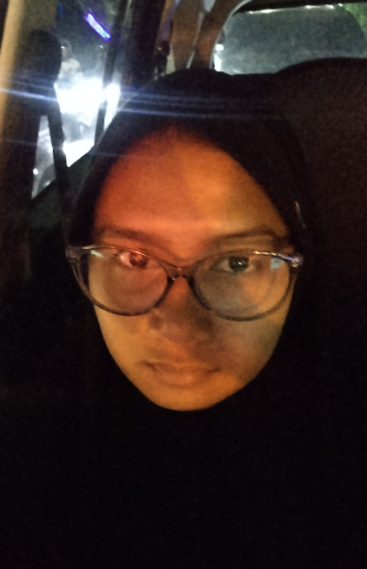

<!-- Banner -->
<h1 align="center">Hello, I'm firstyaningtyas nur alya adriana</h1>
<h3 align="center" style="font-weight:normal;">Web & App Designer | UI/UX | Conflict Mediation | E-learning Enthusiast</h3>

---

<!-- Profile Image -->

  

---

## About Me
I am passionate about **Web Design, App Design, Conflict Mediation, UI/UX, E-learning, and Travelling**.  
I enjoy learning new things related to technology and building meaningful collaborations with people.  
My focus is on creating thoughtful digital experiences that combine functionality and aesthetics.  

---
## Skill Highlights
- Web Design [██████████░░] 80%  
- UI/UX [█████████░░░] 70%  
- App Design [████████░░░░] 60%  
- eLearning [█████████░░░] 75%

  ---

## Connect with Me

  
  
  

---

## Tech Stack

  

---
## Quote of the Day

  

---
## Inspiring Tech Quotes

 “The science of today is the technology of tomorrow.” – Edward Teller  

 “Any sufficiently advanced technology is indistinguishable from magic.” – Arthur C. Clarke  

 “Technology like art is a soaring exercise of the human imagination.” – Daniel Bell  

---
## Currently Exploring
- Cloud Computing and its impact on collaboration  
- Modern UI/UX Design Principles  
- AI and eLearning Integration  
- Conflict Mediation in Digital Communities
  
---

## GitHub Trophies

  

---

## Contributions in the Last Year

  

---

## Activity Graph

  

---

## Language Insights

  
  

---
## Contribution Snake

  

## Profile Visitors

  

